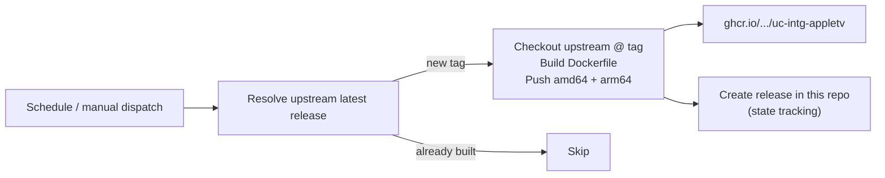

# uc-intg-appletv-docker

Unofficial Docker image builder for the [Unfolded Circle Apple TV integration](https://github.com/unfoldedcircle/integration-appletv).

This repository contains **only build tooling** — a `Dockerfile` and a GitHub
Actions workflow. It does not fork the integration source. The workflow watches
upstream releases, builds a multi-arch image from the tagged source, and pushes
it to the GitHub Container Registry.

> Not affiliated with Unfolded Circle. The integration is licensed under the
> [Mozilla Public License 2.0](https://github.com/unfoldedcircle/integration-appletv/blob/main/LICENSE);
> this repo builds and redistributes it unmodified.

## Why this exists

The upstream project ships an aarch64 PyInstaller tarball for installing on the
Remote itself, but no container image. This repo packages the integration as a
Python-source container so it can run as an external driver (e.g. in Kubernetes
or Docker), reachable by the Remote over a fixed WebSocket URL.

## Image

```
ghcr.io/<owner>/uc-intg-appletv:<version>   # e.g. :0.22.2
ghcr.io/<owner>/uc-intg-appletv:latest
```

`<owner>` is this repository's owner (lowercased). `<version>` is the upstream
release tag without the leading `v`.

## How the build works



- **Trigger:** every 6 hours (`schedule`) or manually (`workflow_dispatch`).
- **State tracking:** after a successful build, a GitHub Release named after the
  upstream tag is created in *this* repo. Scheduled runs skip tags that already
  have a release, so only new upstream releases trigger a build.
- **Manual build:** run the workflow with an `upstream_tag` input to build a
  specific tag, and `force: true` to rebuild one that was already built.
- **Tracking a fork:** change `UPSTREAM_REPO` in
  [`.github/workflows/publish.yml`](.github/workflows/publish.yml) to build from
  a fork instead of `unfoldedcircle/integration-appletv`.

No registry secrets are required — the workflow authenticates to ghcr.io with the
built-in `GITHUB_TOKEN` (`packages: write`).

### First-time setup

1. Push this repo to GitHub.
2. Ensure Actions are enabled and the workflow has package write permission
   (Settings → Actions → General → Workflow permissions → Read and write).
3. Trigger the workflow manually once (Actions → *Build and publish Docker image*
   → Run workflow) to publish the current upstream release.
4. The first published image package is private by default; make it public under
   the package settings if you want unauthenticated pulls.

## Running the image

This integration runs as an external driver with a **fixed URL** — the same
pattern Unfolded Circle uses for the
[Home Assistant integration](https://github.com/unfoldedcircle/integration-home-assistant).
The image ships upstream `driver.json` unchanged; the external driver identity is
configured **on the Remote**, not in the image.

```bash
docker run -d \
  --name uc-intg-appletv \
  -e UC_DISABLE_MDNS_PUBLISH=true \
  -p 9090:9090 \
  -v "$(pwd)/config:/config" \
  ghcr.io/<owner>/uc-intg-appletv:latest
```

Then register the driver on the Remote (replace host/PIN/token), using a
`driver_id` that does not collide with the firmware-embedded `uc_appletv_driver`:

```bash
curl -X POST 'http://<remote-ip>/api/intg/drivers' \
  --user "web-configurator:<pin>" \
  -H 'Content-Type: application/json' \
  -d '{
    "driver_id": "appletv_external",
    "name": { "en": "Apple TV" },
    "driver_url": "ws://<docker-host>:9090/ws",
    "version": "0.22.2",
    "min_core_api": "0.7.1",
    "icon": "uc:integration",
    "enabled": true,
    "token": "<remote-token>",
    "auth_method": "HEADER"
  }'
```

To update the URL/token of an existing driver later, `PATCH
/api/intg/drivers/appletv_external` with the new `driver_url` / `token`.

### driver_id layers

| Context | driver_id |
|---------|-----------|
| Firmware embedded driver | `uc_appletv_driver` |
| This image's `driver.json` (upstream, unchanged) | `appletv` |
| Driver registered on the Remote | `appletv_external` |
| Upstream PyInstaller tarball only | `appletv_custom` |

## Environment variables

| Variable | Image default | Notes |
|----------|---------------|-------|
| `UC_CONFIG_HOME` | `/config` | Pairing state and credentials; mount a volume here |
| `UC_INTEGRATION_HTTP_PORT` | `9090` | WebSocket port the Remote connects to |
| `UC_INTEGRATION_INTERFACE` | `0.0.0.0` | Bind address |
| `UC_DISABLE_MDNS_PUBLISH` | unset | **Set to `true`** for external/fixed-URL deployments |
| `UC_LOG_LEVEL` | `DEBUG` | Log level |
| `UC_CLIENT_NAME` | hostname | Pairing client name prefix |

The container runs as UID `10000`; the mounted config directory must be writable
by that user.

## Apple TV networking caveat

`pyatv` controls the Apple TV over the LAN, and discovery relies on mDNS, which is
typically unreliable from inside containers/pods. Prefer pairing with a static
Apple TV IP and ensuring the container has direct LAN reachability to the device.

## Drift / upstream merge

If upstream adds an official Docker image, this repo can be archived or reduced to
re-tagging the official image. Until then it owns the Dockerfile (e.g. the locale
compilation step).
